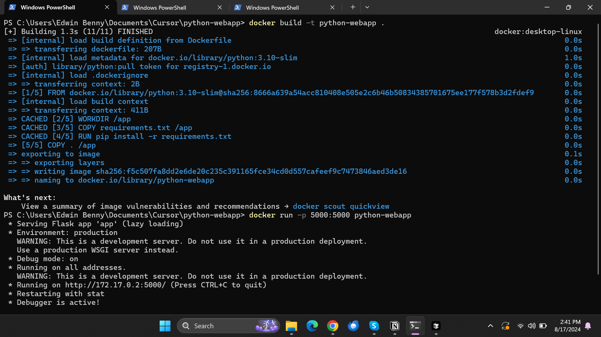
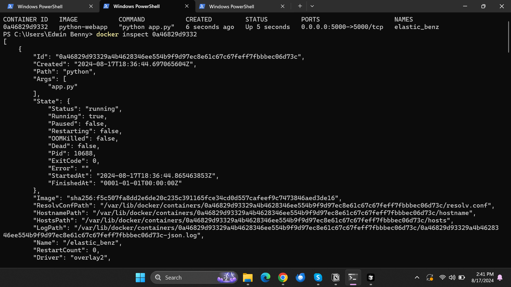
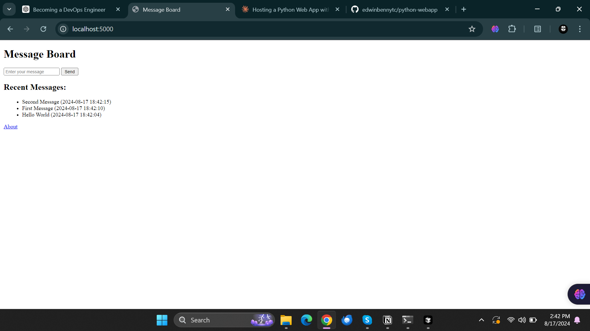
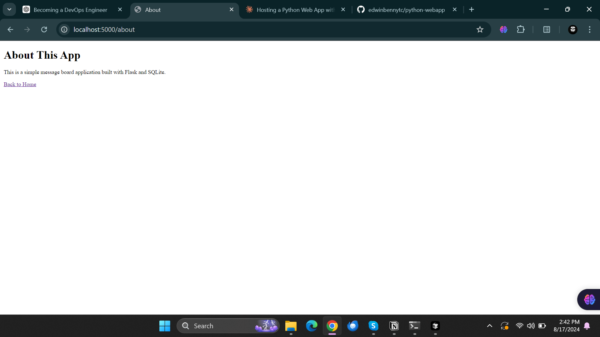

# Simple Message Board Application

This is a simple message board application built with Flask and SQLite.

## Prerequisites

- Docker
- Docker Compose (optional)

## Getting Started

### Build the Docker Image
docker build -t python-webapp .

### Run the Docker Container
docker run -p 5000:5000 python-webapp

The application will be accessible at `http://localhost:5000`.

Home Page:

About Page:

## Project Structure
.
├── app.py
├── requirements.txt
├── Dockerfile
├── templates
│ ├── about.html
│ └── index.html
└── README.md

- `app.py`: The main Flask application file.
- `requirements.txt`: Python dependencies.
- `Dockerfile`: Docker configuration file.
- `templates/about.html`: HTML template for the About page.
- `templates/index.html`: HTML template for the Message Board page.
- `README.md`: This file.

## Usage

- Navigate to `http://localhost:5000` to access the home page.
- Click on "About" to view the About page.
- Add messages using the form on the home page.

